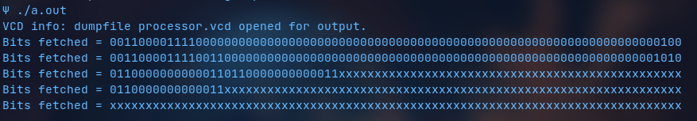
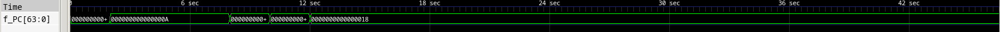
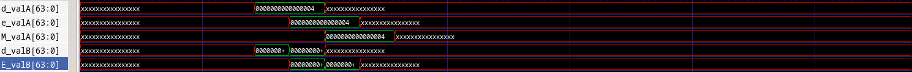

## Overview

Continuing from the mid-evals, we have now implemented a Y86 processor with pipelining support. Each stage has its own module, like they did in SEQ, and each intermediate pipeline register also have their own modules in separate files, named as `rxxx.v`. The final module `processor.v` is used for instantiating the various stages and registers, and to keep track of the outputs using `$monitor`. The centralised register bank module `regarr.v` is used here as well. 

There is a separate module for PC selection called `pc_select.v`, and the PC prediction logic is included in the `fetch.v` file. All data forwarding is taken care of in the stages themselves, with appropriate inputs. The pipeline control logic also has its own module in `pipectrl.v` which decides whther a certain instruction needs to be stalled/bubbled or not depending on the conditions. Data forwarding has been implemented in the `decode.v` file.

The processor has 2kB of instruction memory, 14 registers and 2kB of data memory. Naming conventions for the variables are as is expected for a Y86 pipelined design.

## Implemented Instructions and Methods

- `halt`
- `nop`
- `cmovXX`
- `irmovq`
- `rmmovq`
- `mrmovq`
- `OPq`
- `jXX`
- `call`
- `ret`
- `pushq`
- `popq`

- Stalling
- Bubble
- PC prediction
- Data forwarding

\pagebreak

## Stage 1: Fetch

The fetch stage works on the instruction memory `insmem`, reading 10 bytes at a time. `icode` and `ifun` are split and aligned from the first byte, and valP is decided based on the value of icode. From the second byte of the fetched instruction, the register operand specifiers are also obtained and stored. In the case where the instruction is 10 bytes long, the eight byte constant is stored in `valC`. 

The fetch block now also includes PC prediction and status condition setting. The `pc_select` module is instantiated here, as we need it to update the PC, which requires the predicted PC from this stage. The PC is predicted according to the coniditions discussed in class.

Thus, the inputs and outputs to this stage are as follows:

### Inputs:

- `clk`
- `F_PC`

### Outputs:

- `f_stat`
- `f_icode`
- `f_ifun`
- `f_rA`
- `f_rB`
- `f_valC`
- `f_valP`
- Status conditions:
  - `inst_valid` : set when inst is valid
  - `imem_er` : set when address is invalid
  - `hlt_er` : set when halt is encountered
  - `dmem_er`: set when data memory error is encountered
 
### Other Paramaters

- `insmem` : register array that functions as the instruction memory
- `inst`: register that is used to fetch 10 bytes from `insmem` at the location pointed to by PC
- Forwarded values from future stages, which are used in PC preditcion and selection

The instructions are hardcoded into the processor in this stage in an `initial` block as the instruction memory is local to the fetch stage.

\pagebreak

## Stage 2: Decode

In this stage, the instruction is decoded from the `icode` value and the required values (usually `valA` and `valB`) are obtained from the registers `rA` and `rB` which are read from the central register bank according to operand specifiers that were obtained from the fetch stage. The stack pointer is also required for a few of these instructions. Data forwarding is also used here from further stages, as decode is where we require the updated values for instructions. We have also only accessed `regarr` here, and hence, all the operations for the write back stage have been taken care of here as well. Essentially, due to the presence of the reg file in this stage, the writeback operation from the writeback stage also occurs here. This is the stage that varies the most from its SEQ implementation, as the processes of data forwarding have been added, and the stage has been merged (on a hardware level) with the writeback stage.

### Inputs

- `D_stat`
- `D_icode`
- `D_ifun`
- `rA`
- `rB`
- `e_dstE`
- `M_dstE`
- `M_dstM`
- `W_dstM`
- `W_dstE`
- `D_valC`
- `D_valP`
- `e_valE`
- `M_valE`
- `m_valM`
- `W_valM`
- `W_valE`

## Outputs

- `d_stat`
- `d_icode`
- `d_ifun`
- `d_valC`
- `d_valA`
- `d_valB`
- `d_dstE`
- `d_dstM`
- `d_srcA`
- `d_srcB`

\pagebreak

## Stage 3: Execute

The ALU is instantiated in this stage, and the results of computations on `valA` and `valB` are stored in `valE` (where applicable). In most cases, this is an `OPq` instruction from the ALU. Also, the three flags used by this architecture: zf, of and sf are computed in this stage. The flags are set for the `OPq` instructions and are used for the conditional instructions. This module has not changed much from the SEQ, except for taking inputs from further stages to confirm the status of the processor. 

### Inputs

- `E_stat`
- `m_stat`
- `W_stat`
- `E_icode`
- `E_ifun`
- `E_dstE`
- `E_dstM`
- `E_valA`
- `E_valB`
- `E_valC`

### Outputs

- `e_stat`
- `e_icode`
- `e_dstE`
- `e_dstM`
- `e_valA`
- `e_valE`
- Condition Codes:
    - `e_cnd`
    - `of`
    - `zf`
    - `sf`

**Note:** The ALU module has absolute paths for including the various sub modules. They will have to be modified accordingly.

\pagebreak

## Stage 4: Memory

The portion of instructions that require the altering of or reading from data memory is done in this stage. It is here that we interact with the actual memory of the device with read and write operations. The `fwd` variables are essentially the same as outputs of the stage, except they are sent without any alteration as a forwarded value to other stages, notably to the decode stage.

### Inputs

- `M_cnd`
- `M_stat`
- `M_icode`
- `M_valA`
- `M_dstE`
- `M_dstM`
- `M_valE`

### Outputs

- `m_stat`
- `m_valE`
- `m_valM`
- `m_valAfwd`
- `m_valEfwd`
- `m_dstE`
- `m_dstM`
- `m_icode` 
- `M_cndfwd`

### Other Parameters

- `datamem`: a register that serves as the data memory and is local to the memory stage. 

\pagebreak

## Stage 5: Write Back

Writes either `valE` or `valM` to the required registers in the instructions that call for it. Therefore, this stage handles register updates. These updates are done by accessing the register write functionality in the reg file implemented in the decode block.

### Inputs

- `W_stat`
- `W_icode`
- `W_dstM`
- `W_dstE`
- `W_valM`
- `W_valE`

### Outputs

- `w_stat`
- `w_icode`
- `w_dstM`
- `w_dstE`
- `w_valM`
- `w_valE`

\pagebreak

## Processor Wrapper

The `processor.v` file includes all the required files for all the stages as well as the register bank. This code is mainly meant to set the status conditions for the processor and to monitor and end execution if necessary. The clock is also controlled by this code with an always statement.

This module takes no arguments as all the required files are included and the modules are instantiated. 

## Register Array

This module stores the data contained in all 14 registers and stack pointer using a two dimensional array `regArr`. It is capable of reading and writing to this array of registers depending on the input specifiers given, maximum being two at a time. It takes in the specifiers for the required registers and values (if applicable) to be written to them, and performs the required operations accordingly. 

### Inputs

- `PC`
- `rA`, input for the read operation
- `rB`, input for the read operation 
- `dstM`, input address for write operation
- `dstE`, input address for write operation
- `wrtA`, input values to be written 
- `wrtB`, input values to be written

### Outputs

- `valA`, value in the register specified by `rA`
- `valB`, value in the register specified by `rB`
- `valStk`, value of the stack pointer `%rsp`

## Pipeline Control
Implemented in `pipectrl.v`, this module is responsible for avoiding and navigating the caveats of pipelining. It sets condition codes for the implementation of stalls and bubbles in the fetch, decode and execution stages where required due to occurrences like load/use hazards, ret instruction processing, as well as navigating mispredicted branches in jump instructions. These condition codes are passed as inputs to the respective registers between stages so that their output values at each positive clock edge can be set accordingly.

### Inputs

- `e_cnd`
- `d_srcA`
- `d_srcB`
- `D_icode`
- `E_dstM`
- `E_icode`
- `M_icode`
- `m_stat`
- `W_stat`

### Outputs

- `F_stall` 
- `D_bubble`
- `D_stall`
- `E_bubble`

### Other parameters

- `luhaz`: set in case of load/use hazard
- `inret`: set in case of ret instruction processing
- `misbranch`: miscalculated branch

### Results and Outputs

The code for the processor compiles without any errors, and the executable file `a.out` runs without issues according to the instruction memory given. The output of the instructions given to the processor, however there are a few faults with the data forwarding logic that need to be dealt with. The test instructions run fine, and the data is being forwarded to previous stages.

---